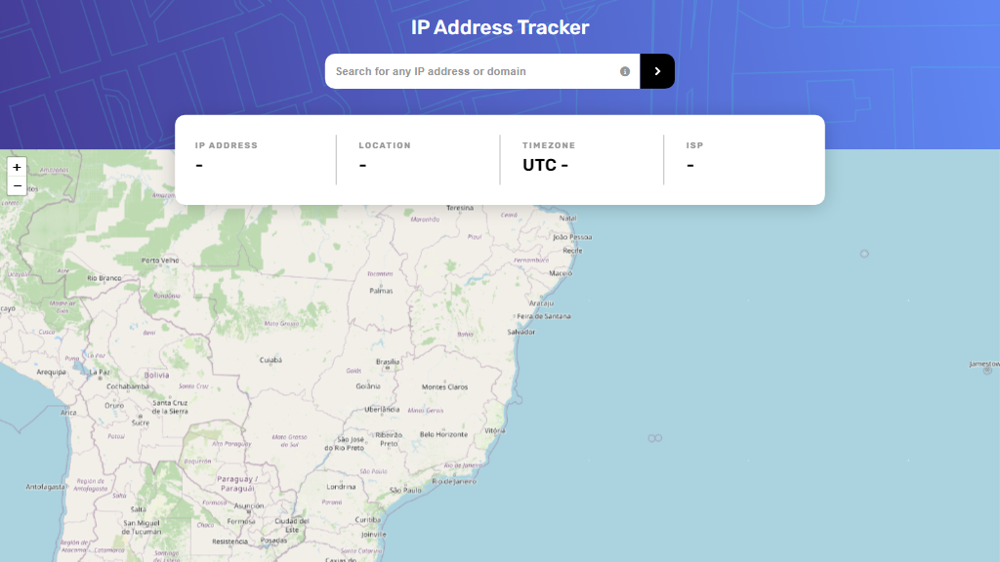

# Frontend Mentor - IP address tracker solution

This is a solution to the [IP address tracker challenge on Frontend Mentor](https://www.frontendmentor.io/challenges/ip-address-tracker-I8-0yYAH0). Frontend Mentor challenges help you improve your coding skills by building realistic projects.

## Table of contents

- [Overview](#overview)
  - [The challenge](#the-challenge)
  - [Screenshot](#screenshot)
  - [Links](#links)
- [My process](#my-process)
  - [Built with](#built-with)
  - [Useful resources](#useful-resources)
- [Author](#author)
- [Donate](#donate)

## Overview

### The challenge

Users should be able to:

- View the optimal layout for each page depending on their device's screen size
- See hover states for all interactive elements on the page
- See their own IP address on the map on the initial page load
- Search for any IP addresses or domains and see the key information and location

### Screenshot

### Links

- Solution URL: [https://github.com/rafaeldevvv/frontendmentor-ip-address-tracker](https://github.com/rafaeldevvv/frontendmentor-ip-address-tracker)
- Live Site URL: [https://rafaeldevvv.github.io/frontendmentor-ip-address-tracker/](https://rafaeldevvv.github.io/frontendmentor-ip-address-tracker/)

## My process

### Built with

- Semantic HTML5 markup
- CSS custom properties
- Flexbox
- CSS Grid
- Mobile-first workflow
- [IP Geolocation API by IPify](https://geo.ipify.org/)
- [LeafletJS](https://leafletjs.com/)
- [Tippy.js](https://atomiks.github.io/tippyjs/)
- [Font Awesome](https://fontawesome.com)

### Useful resources

- [CSS in Action Invisible Content Just for Screen Reader Users](https://webaim.org/techniques/css/invisiblecontent/)
- [Can I Use CSS Nesting?](https://caniuse.com/css-nesting)
- [Why do percentage-width-sized flex box items not properly increase the width of a wrapping table that has an unspecified (i.e. auto) width?](https://stackoverflow.com/questions/34572022/why-do-percentage-width-sized-flex-box-items-not-properly-increase-the-width-of)
- [A Complete Guide to Flexbox](https://css-tricks.com/snippets/css/a-guide-to-flexbox/)
- [Regular expression that matches valid IPv6 addresses](https://stackoverflow.com/questions/53497/regular-expression-that-matches-valid-ipv6-addresses)
- [CSS animate custom properties/variables](https://stackoverflow.com/questions/50661638/css-animate-custom-properties-variables)
- [What is a regular expression which will match a valid domain name without a subdomain?](https://stackoverflow.com/questions/10306690/what-is-a-regular-expression-which-will-match-a-valid-domain-name-without-a-subd)
- [6 Free Libraries to Create Tooltips in JavaScript](https://www.syncfusion.com/blogs/post/6-free-javascript-tooltip-libraries)

## Author

The name's Rafael Maia. You can find me on [Instagram](https://www.instagram.com/rafaeldevvv), [X](https://www.twitter.com/rafaeldevvv), and [Linkedin](https://www.linkedin.com/in/rafael-maia-b69662263). Or you can send me an email [rafaeldeveloperr@gmail.com](mailto:rafaeldeveloperr@gmail.com).

I am a freelancer, so you can also find me on [Fiverr](https://www.fiverr.com/rafael787) and [Upwork](https://www.upwork.com/freelancers/~01a4dc9692c96839dc).

Also, take a look at [my portfolio](https://rafaeldevvv.github.io/portfolio).

## Donate

Also, if you liked this project, consider [buying me a coffee](https://www.buymeacoffee.com/rafael.maia) ☕.
